# 内部人员操作说明

**类器官送检与样本管理系统（V1.0） · 内部人员版**

| 项目 | 内容 |
| --- | --- |
| 适用对象 | 实验室内部人员、实验室管理员（工作台账号 + 微信登录小程序） |
| 对应交付 | 合同附件《系统功能清单》14 项（对照表见文末） |
| 配图环境 | 测试环境 + 种子假数据（**不含真实样本信息**） |
| 版本 | V1.0 · 2026-09 |

> 本说明按**一天的工作顺序**写：登录 → 看待办 → 核验外部送检 → 录入收样 → 石蜡包埋 → 冻存 →
> 质控文档 → 导出 → 管人管单位 → 常见问题 → 日常维护。文末那张家清单对照表可以拿着逐项验收。
>
> 两端分工一句话：**网页工作台功能最全**（核验、改别人的记录、冻存取用、改删登记、管人管单位）；
> **小程序只管填和看**——首页点表新增一条，「我的」里找回自己填过的和内部管理（查看、筛选、导出）。

---

## 一、登录

### 1.1 网页工作台（账号密码）

打开工作台地址，输入管理员分配的用户名与密码，点「登 录」。首次登录后请立刻改掉初始密码；
忘记密码让实验室管理员在「人员与单位 → 内部人员授权」里重置。

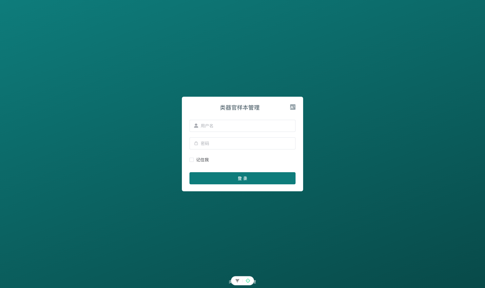

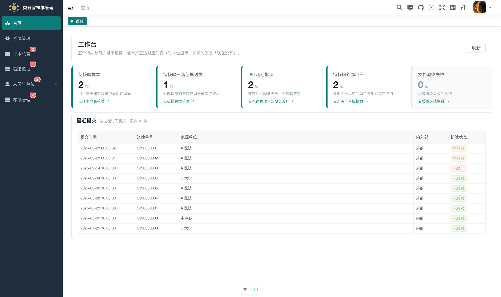

### 1.2 小程序（统一微信登录）

内部人员与外部用户是**同一个入口**：小程序用微信手机号快捷登录（首次登录用手机号自动建账号，
不需要注册）。你是不是「内部人员」不看登录方式，只看管理员有没有在工作台给你授权——

- **内部人员必须由甲方（实验室管理员）在工作台按手机号授权**：人员与单位 → 内部人员授权 →
  「按手机号授权」，填手机号、姓名与工作台初始密码。同一手机号已经登录过小程序的，**原地升级**
  成内部人员，不会新建第二个账号；撤销授权后该账号降回合作单位身份，历史数据保留。
- 授权后小程序「我的」页才会多出「内部管理」板块，首页才会多出第四张表（-80 冻存记录）。

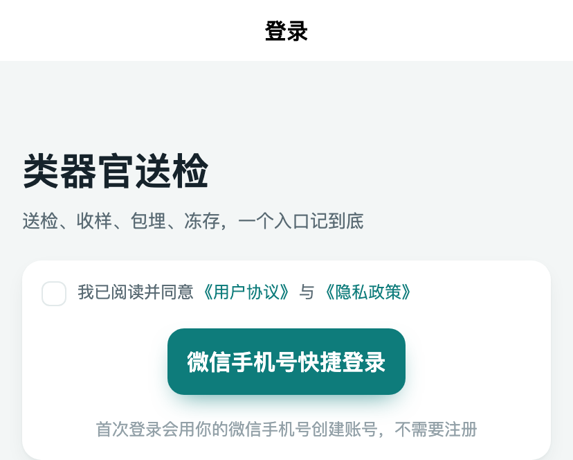

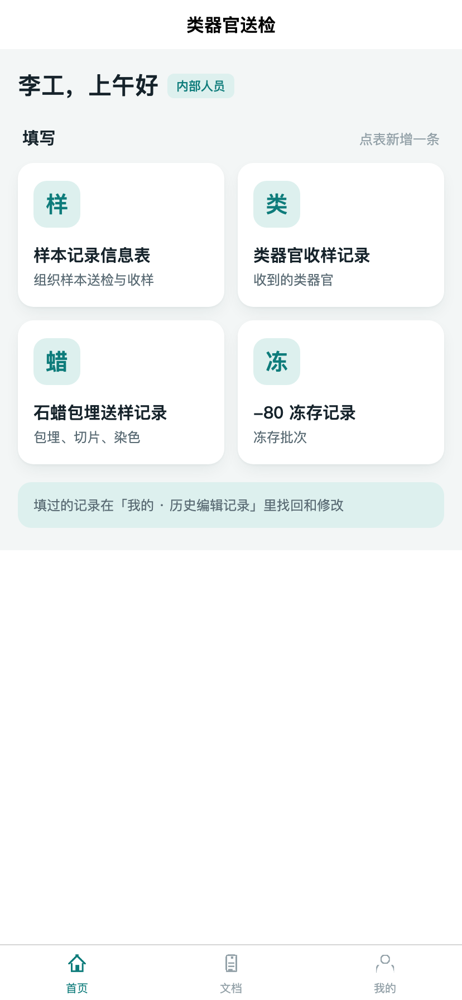

---

## 二、工作台首页：先看待办

登录后落在首页，**五个待办数每次进来现算**，点卡片直达对应列表（为 0 也显示，灰掉的就是现在没有）：

| 卡片 | 含义 | 点进去做什么 |
| --- | --- | --- |
| 待核验样本 | 外部送来还没判定的样本（组织 + 类器官） | 去样本总表核验 |
| 待核验石蜡包埋送样 | 外部提交的石蜡包埋送样等待核验 | 去石蜡包埋核验 |
| -80 超期批次 | 冻存超过阈值天数、还没转液氮 | 去冻存管理（超期页签） |
| 待核验外部用户 | 外部人员提交的单位与组别等待归口 | 去人员与单位核验 |
| 文档渲染失败 | 质控文档生成失败的份数 | 去质控文档查看（见第七章 7.3） |

首页下方的「最近提交」按送检时间倒序列出最多 10 条，用来快速发现刚进来的外部送检。

---

## 三、核验外部送检（样本总表）

**样本总表**是所有样本集中在一张表里（图 5），外部人员填的信息实时进入。支持按来源单位、组别、
样本类别、提交来源、核验状态、收样日期区间、组织类型、内部编号、操作人、供体姓名、住院号批量筛选。

表里的「切片染色」列是提示列：**只统计已核验有效的石蜡块**做过哪些切片与染色，一眼看出这个样本
的包埋进度。

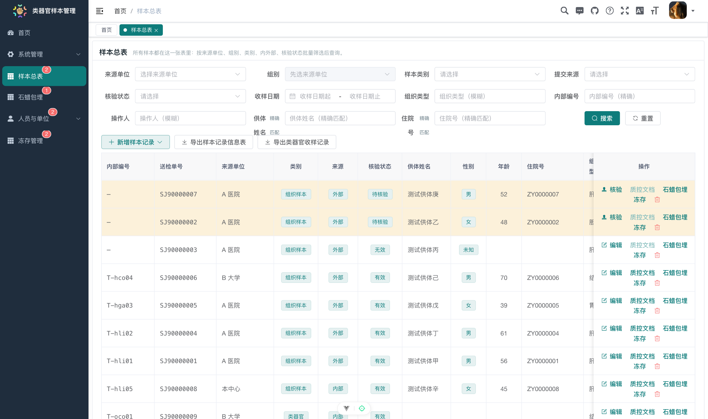

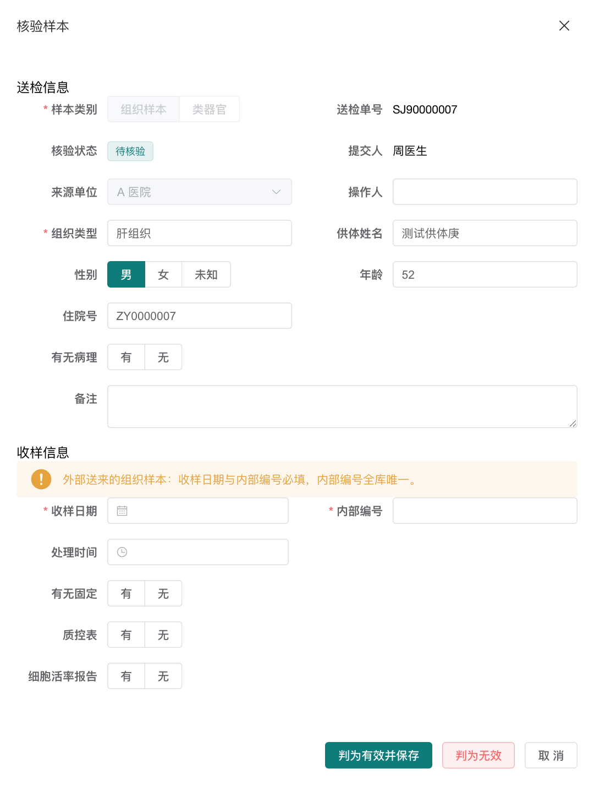

核验（图 6）只有两条路，**必须二选一**：

1. **判为有效**：必须**同时**填「收样日期」与「内部编号」（内部编号全库唯一，重号会被拒），
   可一并填有无固定、处理时间、质控表、细胞活率报告、操作人。内部编号一旦给了，
   这个样本从收样到冻存全程使用同一个编号。
2. **判为无效**：必须写原因。原因会原样出现在外部人员的小程序里（历史编辑记录里能看到
   「无效原因：……」），所以请写成人能看懂的话（例：信息不全：缺住院号）。

> **判错了怎么办**：在工作台打开同一条记录的核验抽屉改判即可（有效 ↔ 无效），改判同样要满足
> 上面的必填要求。小程序里改不了核验状态——待核验、无效的外部样本在小程序里是只读的。

行操作里还有「质控文档」「石蜡包埋」「冻存」，分别直达第七章、第五章、第六章。

---

## 四、录入收样与修改记录

### 4.1 工作台录入（内部样本、补录）

样本总表右上「新增样本记录」按样本类别分**样本记录信息表**与**类器官收样记录**两个入口；
新增后随时可以点行操作的「编辑」修改——**内部人员可以改全部四张表**的记录，含已核验有效的样本，
保存后会记下最后修改人与时间（列表里的「最后修改」列）。

### 4.2 小程序首页点表填写（**新的口径**）

小程序首页**内外部是同一个样子**：没有数字、没有最近记录，点哪一张表都是进该表的**填写页新增一条**。
内部人员是**四张表**：样本记录信息表、类器官收样记录、石蜡包埋送样记录、-80 冻存记录。

填写页顶部是**拍照识别**条：左「拍照识别」、右「从相册选」。拍样本管壁、袋子上的信息或上传截图，
识别结果**只作预填**（只填空项，不会覆盖你已经手填的内容），页面上写着「识别结果仅作预填，请核对后
提交」，**以你核对后的内容为准**。识别出来的原文可以在识别条里展开对照。

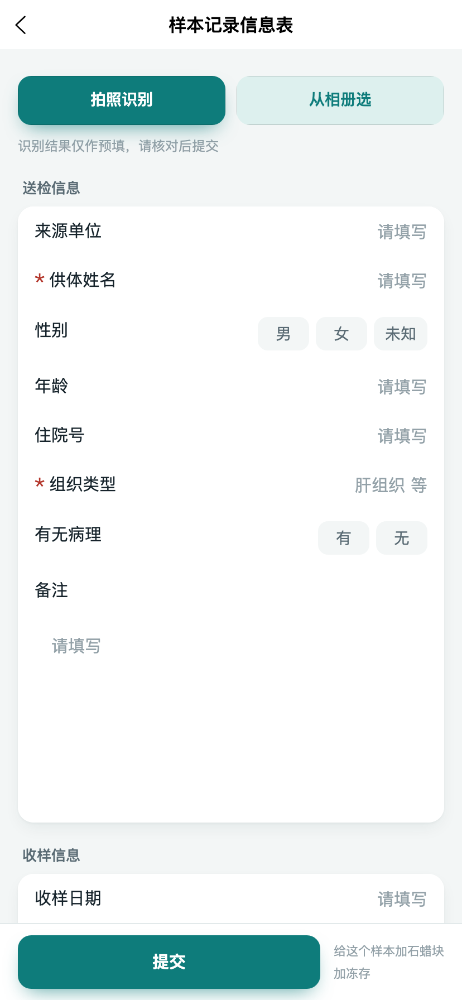

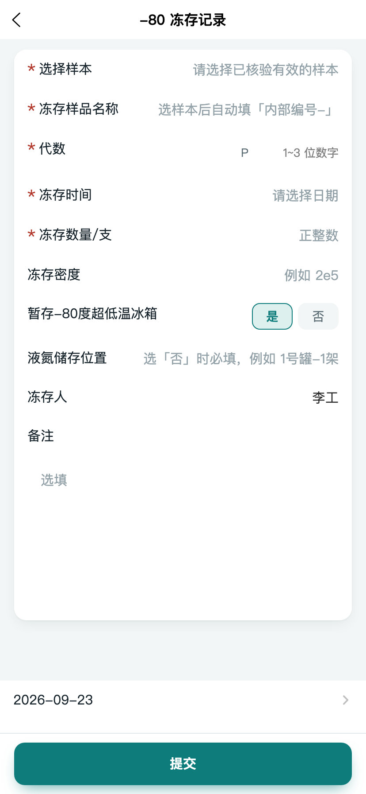

### 4.3 填错了：我的 → 历史编辑记录

**所有人员**（内部、外部都有）都在小程序「我的 → 历史编辑记录」里找回自己填过的记录，
按表分页签（内部四张、外部三张），最近的在前。

- **内部人员**看到的是：本人新增，或最后一次由本人修改的记录；点进去可以**修改**。
- 冻存记录的冻存数量改完会当场做逐笔校验（见第六章 6.3）。
- 外部送来还没核验的样本，在小程序里是只读的（核验与改判在工作台）。

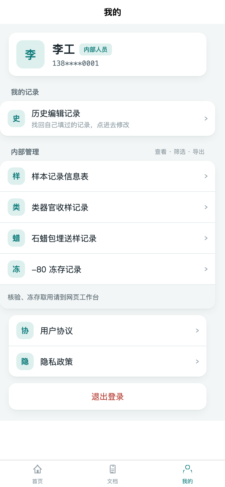

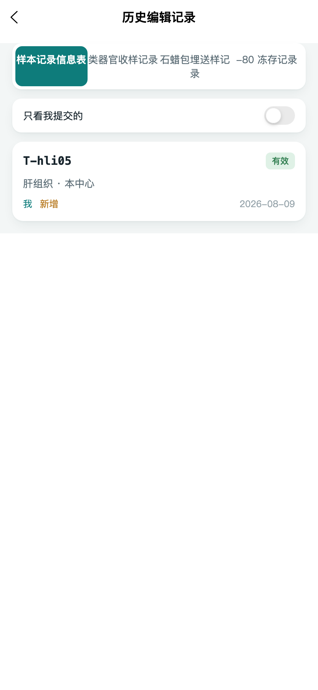

---

## 五、石蜡包埋：补填工序与核验送样

「石蜡包埋」菜单是内外部送样合一的一张表：**待核验的外部送样置顶、浅黄底**，点开即可核验。

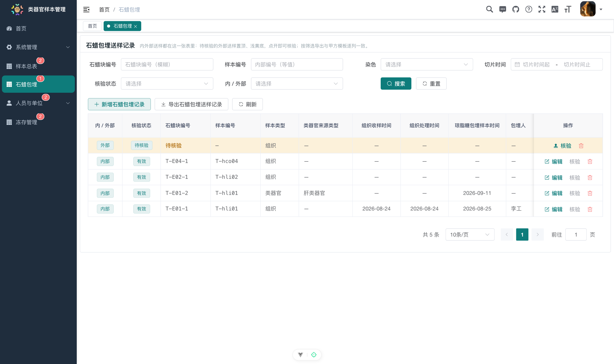

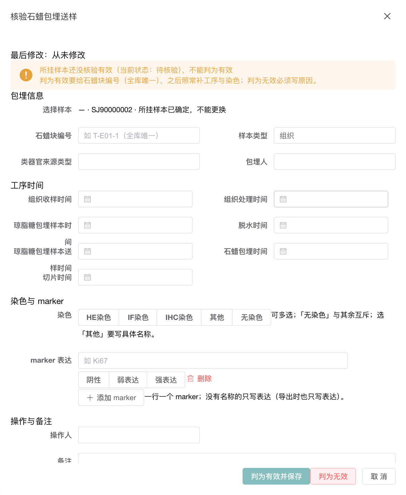

- **核验外部送样**：判为有效**必须给石蜡块编号**（全库唯一），并且所挂样本已经核验有效；
  判为无效必须写原因。核验之后照常补工序与染色。
- **补填工序**（行操作「编辑」）：组织收样时间、组织处理时间、琼脂糖包埋样本时间、包埋人、
  脱水时间、琼脂糖包埋样本送样时间、石蜡包埋时间、**切片**时间。
- **染色与 marker**：染色可多选，选项是 HE / IF / IHC / 其他 / **无染色**（「无染色」与其余染色互斥，
  没做染色就选它，别留空）；选「其他」必须写具体染色名称。marker 表达按「名称 + 阴性 / 弱表达 /
  强表达」逐条添加（例如 Ki67：强表达）。
- **对外可见范围**：合作单位在小程序里能看到自己样本的石蜡包埋情况（含石蜡块编号、操作人、包埋人），
  但**看不到真实内部编号**。
- 表上的「导出石蜡包埋送样记录」导出当前筛选结果，列名列序与甲方模板逐列一致（见第八章）。

---

## 六、冻存：登记、取用、转液氮与超期提醒

### 6.1 冻存批次列表

「冻存管理」按页签分：全部、-80 超期、液氮。**批次列表按超期置顶、整行浅红**；顶部有「只看超期」
开关与内部编号、冻存样品、位置、冻存时间筛选。

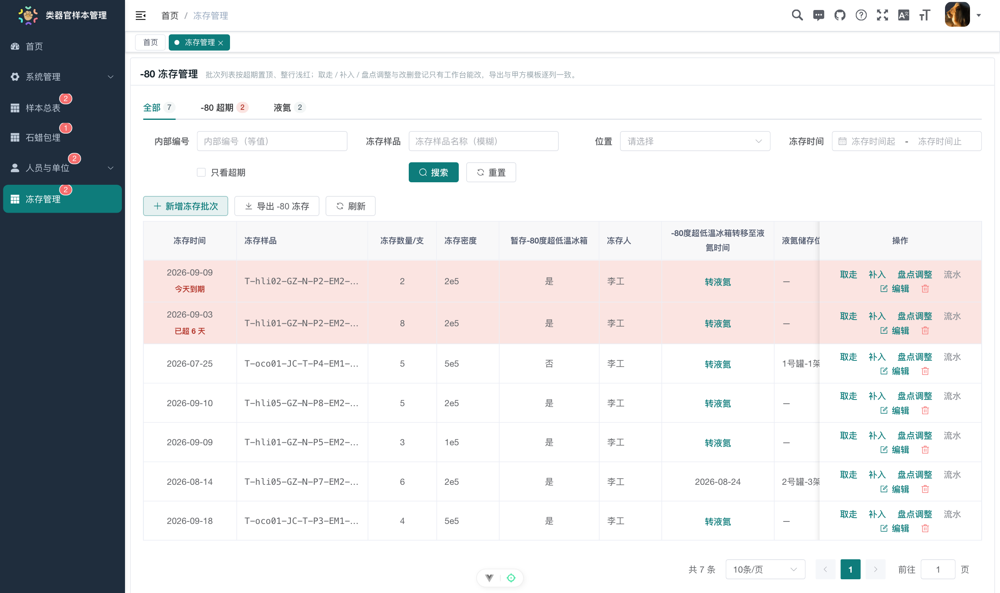

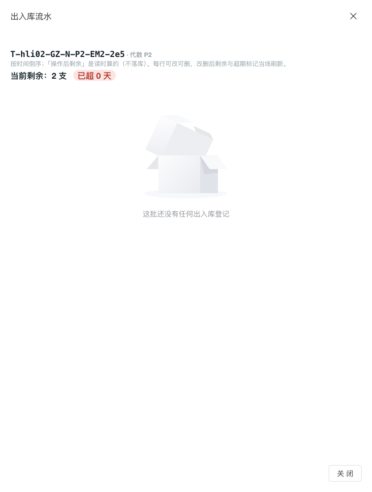

每条批次记录**冻存代数**（如 P2、P7）、冻存数量、冻存密度、暂存 -80 度超低温冰箱、冻存人、
是否已转液氮与液氮储存位置、当前剩余支数、当前位置（-80 冰箱 / 液氮）、最后修改。

### 6.2 四种操作＋转液氮

| 操作 | 怎么用 | 结果 |
| --- | --- | --- |
| 取走 | 选批次 → 填取走支数（正整数，不得超过当前剩余）、用途、经手人、时间 | 产生一笔负数流水，剩余相应减少；超取被拒且不产生流水 |
| 补入 | 同上，支数为正 | 剩余增加 |
| 盘点调整 | 清点后按实际数量调整 | 只增一条调整流水，不改历史 |
| 转液氮 | 点行操作「转液氮」，填时间与液氮储存位置 | 批次位置当场变液氮，超期标记与页签数字当场刷新（不必等定时任务） |
| 流水 | 看该批次全部出入库流水（按时间倒序，「操作后剩余」是读时算的） | 每行可改可删 |

### 6.3 登记填错了：怎么改、怎么删

- **改**：冻存管理 → 行操作「流水」→ 找到那一笔 → 「修改」，可改支数、用途、经手人、时间；
  也可在批次行操作「编辑」里改**初始支数**。
- **删**：流水行的「删除」（软删，库里仍留痕，追溯不丢）。
- **校验规则（改不动的两种）**：保存前会从初始支数出发、按发生时间正序**逐笔累加**，
  **任何一步小于 0 都拒绝**——只会算最终剩余是不够的，那会改出「当时只剩 2 支却取走了 3 支」的账。
  另外**登记类型不能改**，要换类型就删掉重登；盘点调整类的登记只能在**工作台**改删。
- 小程序里**只能改本人录的冻存记录的冻存数量**（校验规则相同）；取走 / 补入 / 转液氮 / 盘点调整
  与改删登记都在工作台，小程序「我的 → 内部管理」是小程序里唯一能看 -80 冻存记录的地方，且只读。

### 6.4 超期提醒（**超过两周**）

-80 冻存**超过两周**（`lqg.cryo.overdue-days`，默认 **14 天**）就是超期：首页「-80 超期批次」计数、
  列表整行浅红、超期页签都会提示转入液氮。阈值是系统参数，要改天数走「系统管理 → 参数设置」，
  **页面上的文案不写死天数**，显示的是后端算出来的「已超 N 天」。

---

## 七、质控文档：编辑、预览、完成并同步

### 7.1 编辑（工作台，唯一不用抽屉的录入页）

进入方式：**样本总表行操作「质控文档」**（只对已核验有效的样本可点）。三份文档在同一个页面顶部切换：

| 页签 | 文档 | 对外 |
| --- | --- | --- |
| 样本质控表 | 收样描述、观察情况、预处理情况（各 1–3 张图 + 情况描述）、附件 | 送检方可见 |
| 类器官质控表 | 类器官培养与质控信息、图片与附件 | 送检方可见 |
| 类器官质量评分表 | 逐项评分 | 送检方可见 |

页头的**七项从样本主档带出、只读**（来源单位、患者姓名、性别、收样时间、处理时间、操作人、
内部编号）——要改请去**样本总表**改。三个页签各自记「草稿 / 已完成」徽标，**保存草稿只存当前页签**，
换页签回来时没保存的改动还在。

图片支持拖拽调整顺序、点图放大；附件可挂多个，单个不超过 50 MB。

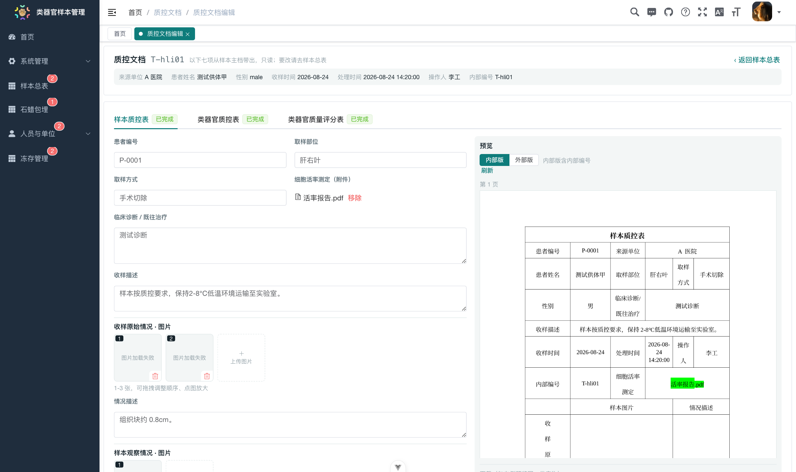

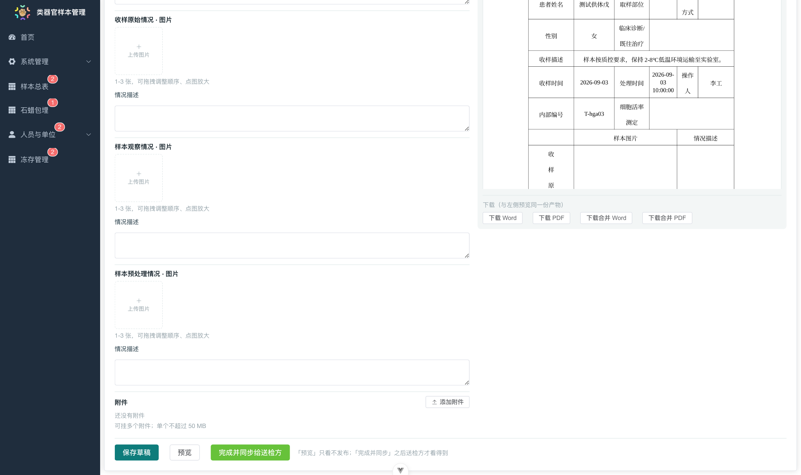

### 7.2 预览、完成并同步、下载

1. **保存草稿**：先存下当前页签的改动。
2. **预览**：右栏按**内部版 / 外部版**渲染页面图，逐页可以看、可以放大。**预览只看，不发布。**
3. **完成并同步**：点这一下之后，该文档才是「已发布」，**送检方的小程序里才看得到**（外部版渲染
   成功之后才出现）。完成人与时间会记下来。
4. **改过之后要重新同步**：已完成状态下页脚提示「已同步给送检方 · 修改后需重新同步」，
   按钮变成「撤回」；撤回后送检方立刻看不到，改完再「完成并同步」一次。
5. **下载**：预览面板与文档渲染状态页都能下载——**下载 Word**、**下载 PDF**，
   以及把已完成的几份按固定顺序拼起来的**下载合并 Word / 下载合并 PDF**。评分表没有独立的合并件。

### 7.3 生成失败了怎么办

「质控文档 → 文档渲染状态」页输入样本 id、选文档与版本（内部版 / 外部版）点「刷新状态」：

- **已生成**：显示页数与模板版本，右侧可直接下载 Word / PDF。
- **这份文档渲染失败了**：页面上会显示后端给的原因，点「重新生成」重试。重试仍失败就是
  模板或图片/附件有问题（先检查文件是否损坏、是否超过 50 MB），把原因截图发给乙方。
  首页「文档渲染失败」卡片点进来就是这一页。

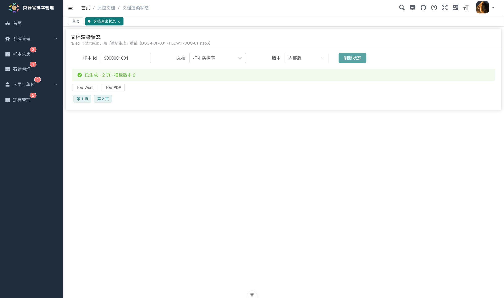

---

## 八、导出四张 Excel

四张表都能导出成 Excel，**工作台与小程序两处**都能导，导出的表头与列序和甲方模板逐列一致。

| 表 | 工作台在哪导 | 小程序在哪导 |
| --- | --- | --- |
| 样本记录信息表 | 样本总表 → 「导出样本记录信息表」 | 我的 → 内部管理 → 样本记录 |
| 类器官收样记录 | 样本总表 → 「导出类器官收样记录」 | 我的 → 内部管理 → 类器官收样 |
| 石蜡包埋送样记录 | 石蜡包埋 → 「导出石蜡包埋送样记录」 | 我的 → 内部管理 → 石蜡包埋 |
| -80 冻存记录 | 冻存管理 → 「导出 -80 冻存」 | 我的 → 内部管理 → -80 冻存 |

**工作台导出的是当前筛选结果**（不筛选就是全部）。小程序里同样是「你筛了什么就导出什么」，
导出后弹出「打开 / 发送到微信」：**「打开」**用微信内置查看器打开表格（右上角菜单可保存或用其他
应用打开），**「发送到微信」**直接把这个文件发给同事或发给自己。

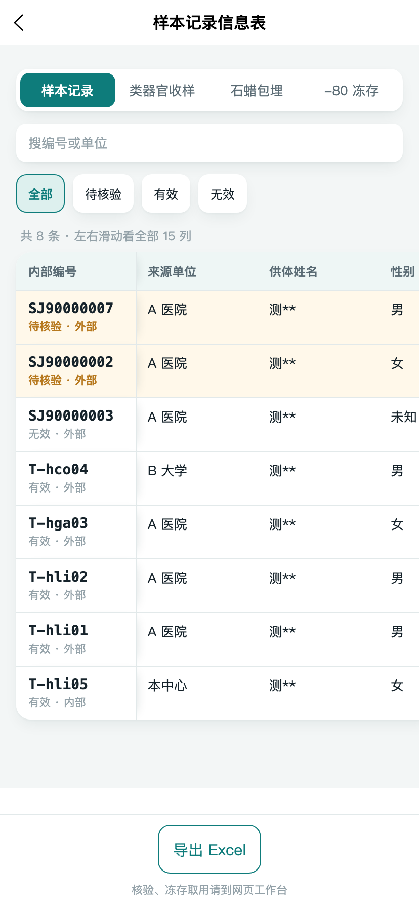

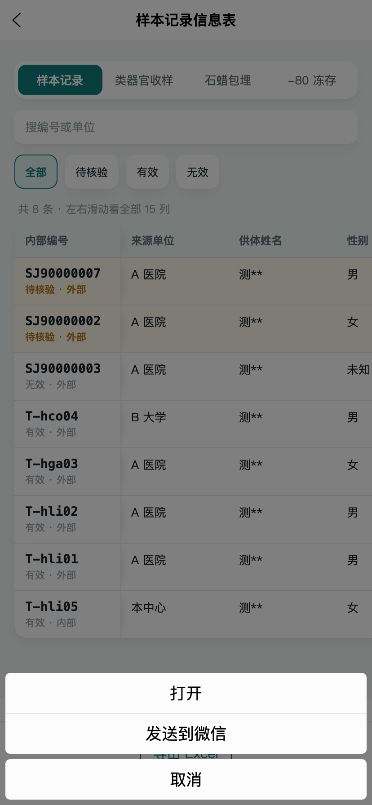

---

## 九、小程序里的「内部管理」（查看、筛选、导出）

「我的 → 内部管理」是内部人员专属板块（**外部人员整块不渲染**），四个入口进四张表的表格页：
**只读查看**（列名列序照甲方模板、首列冻结、左右滑）、按关键字与状态筛选、导出 Excel。

这里的边界要记牢：**新增走首页，改自己录的走「历史编辑记录」，核验 / 冻存取用 / 改别人录的
都在工作台**（板块底部就写着「核验、冻存取用请到网页工作台」）。

---

## 十、人员与单位：核验外部用户、维护组别、授权内部人员

「人员与单位」下三个菜单：

1. **内部人员授权**（图 20）：按手机号把同事挂成内部人员，可选角色「内部人员 / 实验室管理员」，
   还能改角色、重置工作台密码、撤销授权（撤销后立刻退出登录，降回合作单位身份）。
2. **来源单位与组别**（图 21）：单位与组别**不物理删，只启用 / 停用**；停用的不再出现在小程序的
   选择器里，已绑定的人不受影响。右边是该单位下的组别与已核验人数。
3. **外部用户**（图 22）：核验外部人员**自选**的单位与组别。自填的单位 / 组别在通过时**必须选
   「新建」或「归并到已有」**——通过之后，他才开始与**同组**同事互看样本。已核验的可以「改归组」。

> 可见范围口径（培训时最常被问）：合作单位的人员能看到与自己样本相关的全部内容（质控结论、评分、
> 石蜡包埋情况与服务端给的送检单号）；**同单位不同组看不到彼此的样本，同组可以看**。

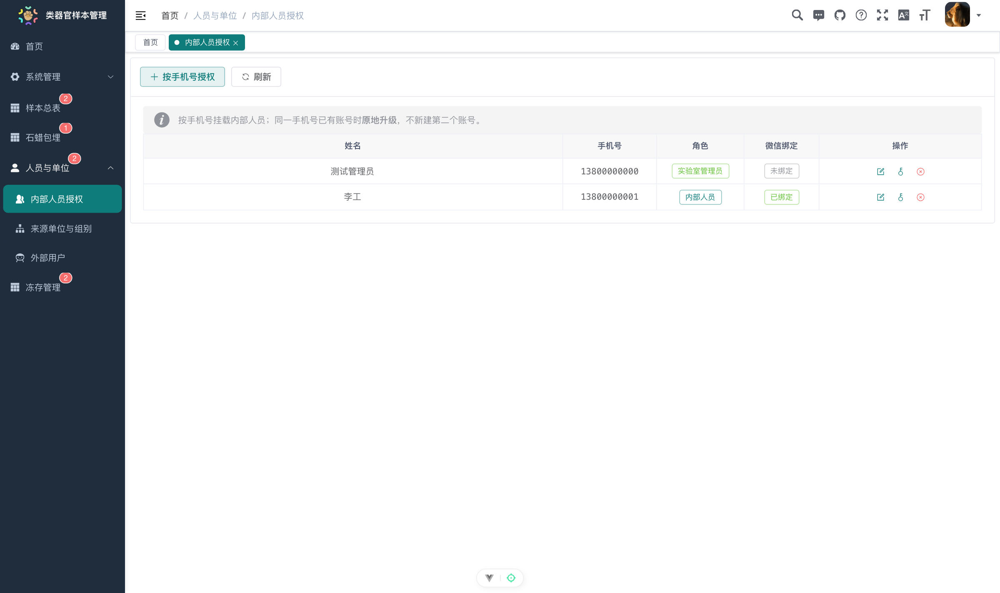

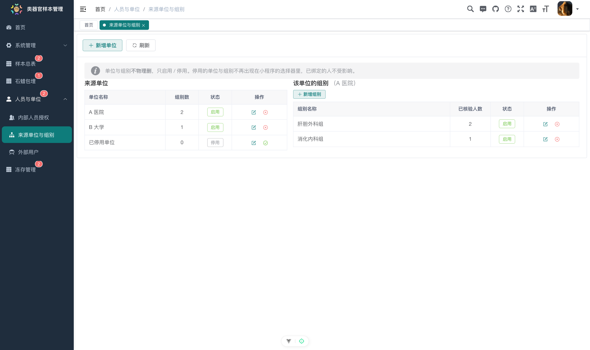

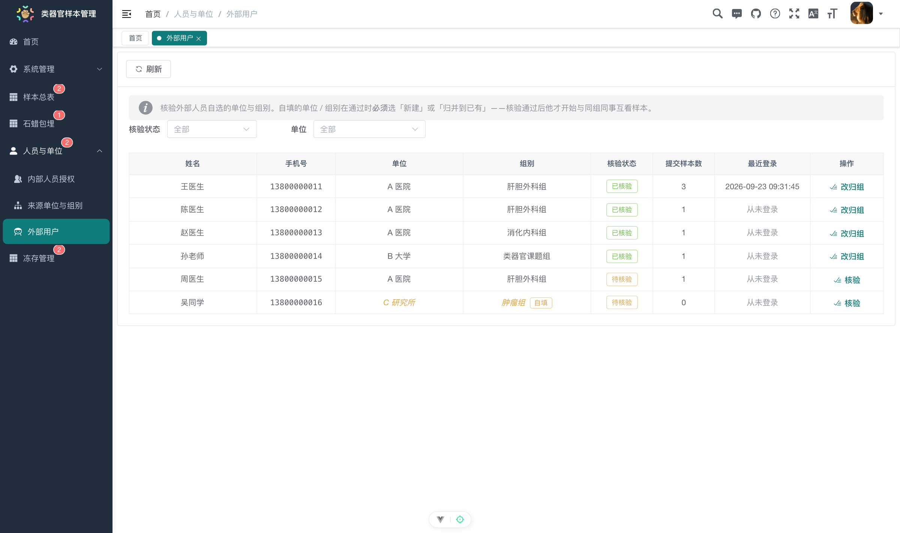

---

## 十一、合作单位在小程序里看到什么（内部人员需知道）

培训时外部用户会问的问题，这里先备好答案：

- 首页只有**三张表**（没有 -80 冻存记录），点哪张都是新增一条。
- 「我的 → 历史编辑记录」里能看到**本人与同组已核验同事**的记录，有「只看我提交的」开关；
  本人**待核验 / 无效**的记录可以改后重提，其余只读。
- 「文档」页按时间与类型筛选，点开预览（样式与原版 Word 一致、图片可放大缩小），
  每份可「下载」，同一样本有两份以上时还有「合并预览 / 合并下载」。
- 下载的真实样子：**「打开」后用右上角菜单保存**，或者**「发送到微信」**——
  小程序不能直接存进手机的文件夹，培训时一定要讲这一句，否则第一个问题就是「下载到哪去了」。

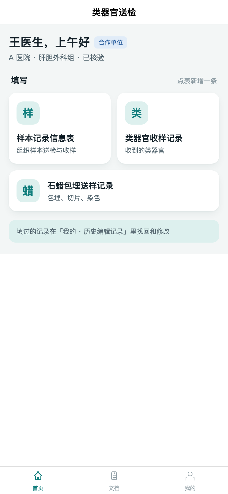

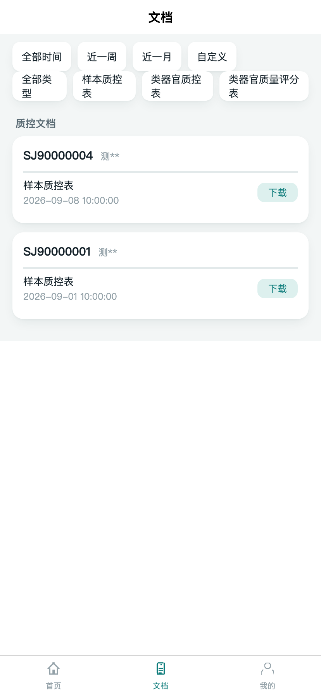

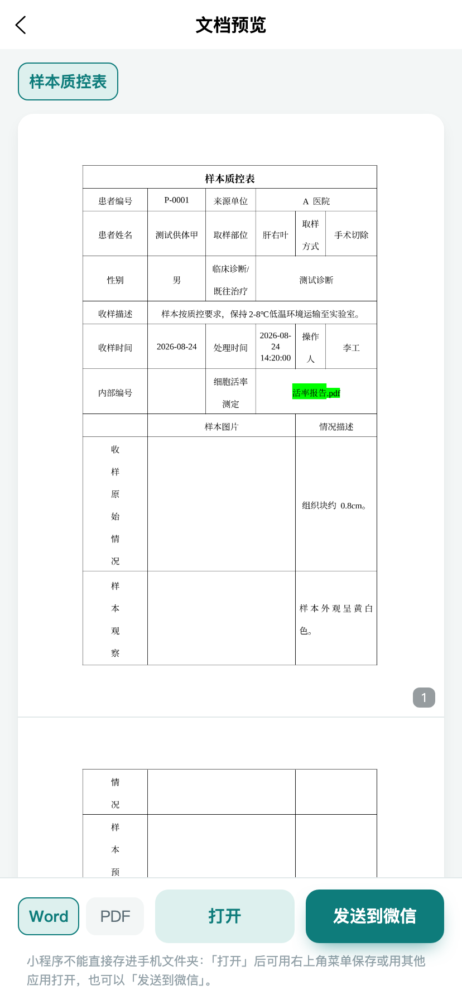

---

## 十二、常见问题

| # | 现象 | 怎么办 |
| --- | --- | --- |
| 1 | 拍照识别不准 / 认错了 | 识别结果**只是预填**：直接在表单里手改，以核对后的内容为准。识别只填空项、不覆盖已填内容；识别失败不挡手填，直接从「从相册选」再来一张或全部手填 |
| 2 | 质控文档生成失败 | 质控文档 → 文档渲染状态 → 填样本 id → 刷新状态，看失败原因 → 「重新生成」。反复失败先查图片 / 附件是否损坏或超 50 MB，再截图发乙方 |
| 3 | 误判有效 / 误判无效 | 工作台样本总表打开该记录的核验抽屉改判（有效 ↔ 无效），改判同样要满足必填项；判无效的原因外部看得到，记得写清楚 |
| 4 | 外部用户说看不到文档 | 先看这份文档是不是「已完成并同步」（草稿态送检方看不到）；再看该用户是否已核验、是不是这个样本的送检人本人或同组 |
| 5 | 小程序里改不了某条记录 | 外部送来还没核验的样本、以及别人录的记录在小程序里只读；改判与改别人的记录都在工作台 |
| 6 | 导出点了没反应 | 小程序导出会先下载再弹「打开 / 发送到微信」，网络慢时多等几秒；一直失败就用工作台导出（两处导出同一个视图） |
| 7 | 超期天数要改 | 系统管理 → 参数设置 → `lqg.cryo.overdue-days`（默认 14 天）；改完首页计数与列表标记当场按新阈值算 |
| 8 | 同一手机号想升级成内部人员 | 内部人员授权 → 按手机号授权，同一手机号**原地升级**，不新建第二个账号 |

---

## 十三、日常维护

- **备份**：生产环境数据库每日自动备份由部署方（乙方）在服务器上执行，**内部人员不需要做任何操作**；
  需要找回历史数据、做恢复演练或查备份状态，联系乙方运维。备份与恢复的操作细节属运维手册，不在这份说明里。
- **账号**：内部人员离职或不再参与项目，请及时在「内部人员授权」里撤销授权；工作台密码不要共用，
  初始密码首次登录后立刻改。管理员账号只在需要管人、管单位、改参数的机器上登录。
- **数据纪律**：真机试用阶段也**不要**把真实受试者信息填进测试环境；测试环境一律用假数据。
- **发布后的改动**：需求与口径的任何调整走变更记录（CR），别口头改；本说明随口径变化更新，
  变更点会在版本行标注。

---

## 附：合同《系统功能清单》14 行 ↔ 本说明章节对照表

> 用法：验收时拿着这张表逐项翻到对应章节，两端各点一遍即可。功能清单原文见合同附件《系统功能清单》。

| # | 模块 · 功能（合同原文） | 本说明对应章节 | 在哪一端验收 |
| --- | --- | --- | --- |
| 1 | 小程序 · 首页 · 四张表在线填写 | 4.2 小程序首页点表填写；第九章 内部管理 | 小程序（内部四张 / 外部三张） |
| 2 | 小程序 · 首页 · 拍照识别预填 | 4.2 拍照识别与核对 | 小程序填写页顶部 |
| 3 | 小程序 · 文档 · 文档列表与预览 | 7.2 预览；第十一章 外部看到的文档 | 小程序「文档」页 |
| 4 | 小程序 · 文档 · 文档下载 | 7.2 下载 Word / PDF / 合并；第八章 小程序导出 | 小程序预览页与内部管理 |
| 5 | 小程序 · 登录与权限 · 微信登录与授权 | 1.2 小程序统一微信登录；第十章 1 内部人员授权 | 小程序登录页 + 工作台人员与单位 |
| 6 | 小程序 · 登录与权限 · 可见范围 | 第十章 3 外部用户核验；第十一章 外部看到什么 | 工作台核验 + 小程序（同组互看） |
| 7 | 网页工作台 · 样本总表 | 第三章 核验外部送检（样本总表） | 工作台样本总表 |
| 8 | 网页工作台 · Excel 导出 | 第八章 导出四张 Excel | 工作台四张表 + 小程序内部管理 |
| 9 | 网页工作台 · 内外部区分与切片染色提示 | 第三章「切片染色」列；第五章 石蜡包埋 | 工作台样本总表 |
| 10 | 网页工作台 · 质控文档编辑 | 第七章 质控文档编辑、预览、完成并同步 | 工作台质控文档编辑页 |
| 11 | 编号与冻存 · 内部编号与冻存代数 | 第三章 1 内部编号；第六章 6.1 冻存代数（P2、P7） | 工作台样本总表 + 冻存管理 |
| 12 | 编号与冻存 · 冻存超期提醒与出入库追溯 | 第六章 6.2 取走 / 补入 / 转液氮；6.3 改删登记；6.4 超期（超过两周） | 工作台冻存管理 |
| 13 | 石蜡包埋 · 染色与 marker 选择 | 第五章 染色（HE / IF / IHC / 其他 / 无染色）与 marker 表达 | 工作台石蜡包埋 |
| 14 | 部署与运维 · 云服务器部署与备份 | 第十三章 备份（由部署方执行） | 乙方运维（协助项） |

---

*本说明由乙方（开发方）编写，配图取自测试环境的种子假数据。口径以合同、变更记录（CR）与系统实际
实现为准；发现说明与系统不一致的地方，请报给乙方更正。*
