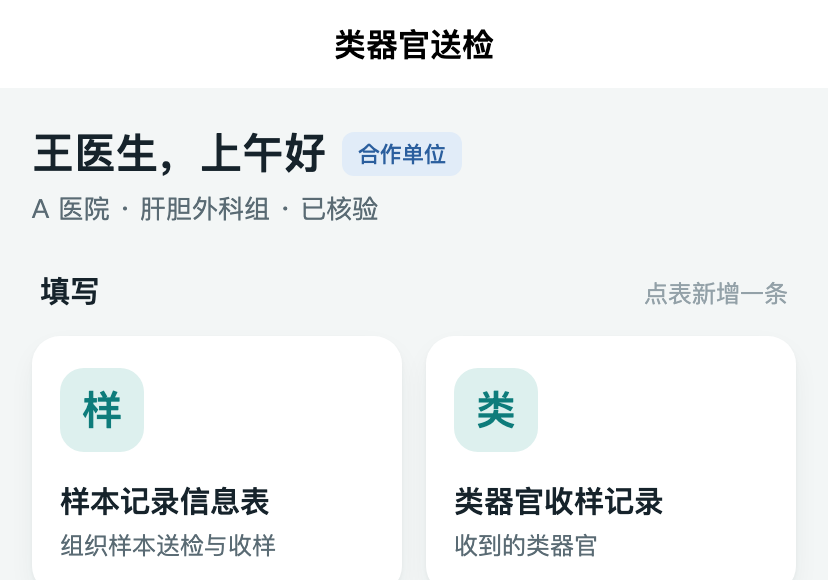
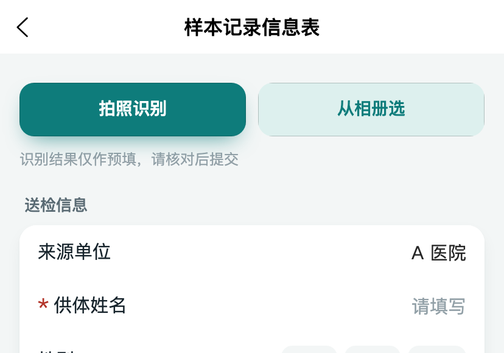
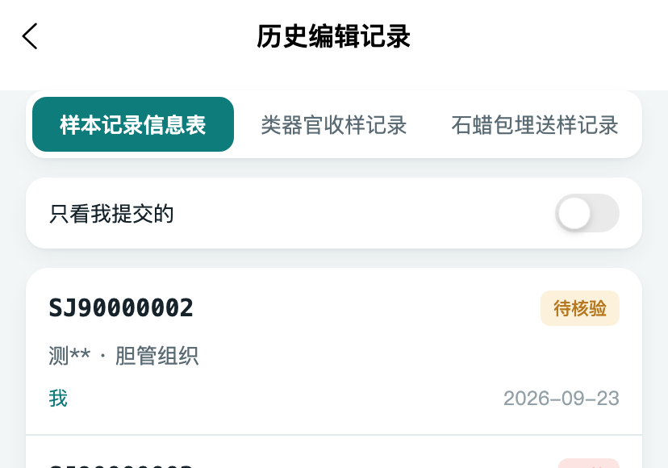
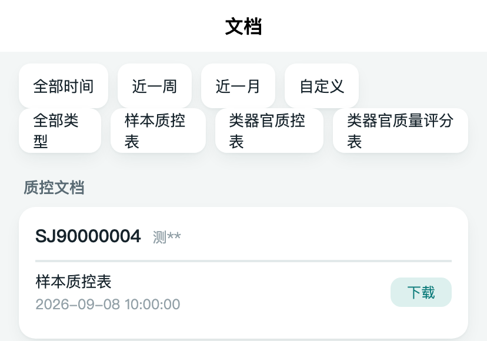
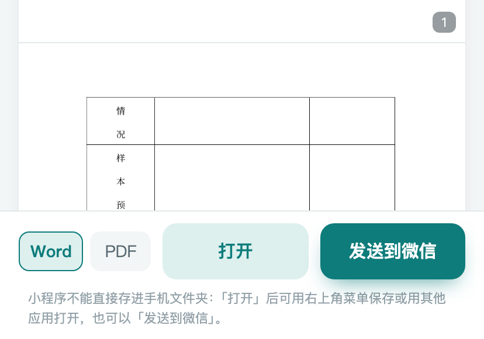

# 合作单位操作说明（小程序 · 一页）

四件事：<strong>登录</strong> → <strong>填表</strong>（拍照识别，识别结果要<strong>核对</strong>）→
<strong>找回并修改自己填过的</strong> → <strong>看结果、下载</strong>。不需要注册，也不需要装 App。

## 一、登录：微信手机号快捷登录

打开小程序 → 勾选《用户协议》与《隐私政策》 → 点「微信手机号快捷登录」。
首次登录会用你的微信手机号自动建账号，**不需要注册**；一个人一个账号，换手机也能登。
登录后首页顶部会显示你的单位与组别。

## 二、填表：首页点表新增一条

首页有**三张表**：样本记录信息表、类器官收样记录、石蜡包埋送样记录——**点哪一张都是新增一条**，
填完点「提交」即可（提交后是待实验室确认状态）。

- **拍照识别**：填写页顶部有「拍照识别」和「从相册选」，拍样本管壁、袋子上的字或上传截图，
  系统会把认出来的内容填进空项。**识别结果只是预填，请逐项核对后再提交，以你核对后的内容为准。**
  认错了直接在表单里改；也可以完全不用识别、全部手填。
- 带 <strong>*</strong> 的是必填项；「来源单位」按你的单位自动带出。
- **种属**（必填）：点开直接点「人 / 鼠兔 / 移植猪 / 鸡」中的一个；列表里没有的，在上面的框里输入，再点「使用「…」」。提交后想改，看下一节。

## 三、找回并修改自己填过的：「我的 → 历史编辑记录」

小程序底部「我的」→「历史编辑记录」，按表分页签，**最近的在前**。

- 你能看到**自己提交的**和**同组同事提交的**记录；点右上「只看我提交的」只留自己的。
- **本人提交、实验室还没确认（或已判为无效）的记录，点进去可以改后重新提交**；
  实验室确认过的、以及同组同事的记录是只读查看。
- 列表上会写清楚每条的状态（待实验室确认 / 有效 / 无效），判无效的会给出原因。

## 四、看结果、下载质控文档

底部「文档」页按时间和类型筛选，点一份进**预览**：样式与原版 Word 一致，图片可点开放大、双指缩放；
同一样本有多份时可以「合并预览」。

**下载怎么用（务必看完）**：小程序**不能直接把文件存进手机的文件夹**。在预览页底部选 **Word / PDF**，然后二选一：

1. 点 **「打开」**：文件用微信内置查看器打开，**右上角**的菜单里可以保存到手机、转发或用其他应用打开；
2. 点 **「发送到微信」**：直接把这份文件发给自己或同事，在微信聊天里就能保存和转发。

<em>看不到自己样本的结果？请联系中心并告知送检单号（形如 SJ90000001）。</em>

